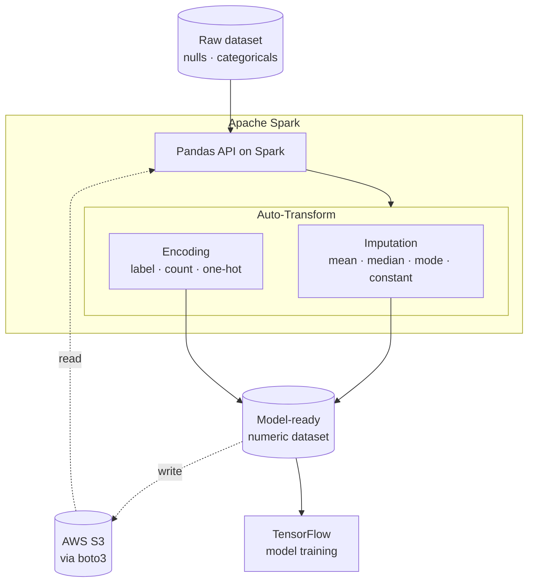
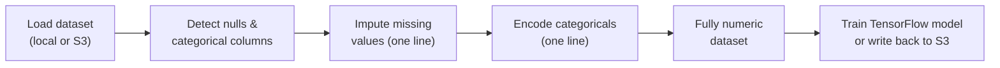

<div align="center">

# PySpark Auto-Transform

**One-line missing-value imputation and categorical encoding for PySpark** — plus built-in AWS S3 and TensorFlow integration.

Turn a raw, messy Spark DataFrame into a fully numeric, model-ready dataset in a single call, using the Pandas API on Spark.

<br/>


<br/>


<br/>

[**Overview**](#overview) · [**Features**](#key-features) · [**Architecture**](#architecture) · [**Example**](#example-before--after) · [**Usage**](#usage)

</div>

---

## Navigation

- [Overview](#overview)
- [The Problem](#the-problem)
- [Key Features](#key-features)
- [Capabilities](#capabilities)
- [Architecture](#architecture)
- [How It Works](#how-it-works)
- [Example: Before & After](#example-before--after)
- [Getting the Code](#getting-the-code)
- [Usage](#usage)
- [Tech Stack](#tech-stack)
- [Roadmap](#roadmap)
- [Contributing](#contributing)
- [License](#license)
- [Author](#author)

---

## Overview

**PySpark Auto-Transform** is an open-source contribution to Apache Spark that automates the most repetitive part of any machine learning pipeline: getting raw data into a clean, fully numeric form a model can actually train on.

It adds **automatic imputation** of missing values and **automatic encoding** of categorical columns to PySpark, built on the **Pandas API on Spark** so the workflow feels familiar to anyone coming from pandas, while scaling across a Spark cluster. It also integrates **boto3** for reading and writing data to AWS S3, and **TensorFlow** for training models on the prepared output.

The goal is simple: take feature preparation that normally spans dozens of lines of column-by-column boilerplate and collapse it into a single call.

---

## The Problem

Before a dataset can train a model, every value has to be numeric and complete. On Spark, doing that by hand means:

- filling nulls column by column, choosing a strategy per column,
- indexing or encoding each categorical column individually,
- casting types and reassembling the DataFrame,
- and repeating all of it every time the schema changes.

It's slow, verbose, and easy to get subtly wrong. PySpark Auto-Transform handles the whole step in one pass, so you spend time on modeling, not plumbing.

---

## Key Features

- **One-line imputation** — replace missing values across the dataset using a chosen strategy.
- **One-line encoding** — convert categorical/object columns into numeric form automatically.
- **Pandas API on Spark** — familiar pandas-style ergonomics, distributed by Spark under the hood.
- **AWS S3 integration** — read source data and write processed output directly to S3 via **boto3**.
- **TensorFlow-ready output** — hand the prepared, numeric dataset straight to a TensorFlow model.
- **Model-ready guarantee** — every value ends up numeric and complete, ready for training.
- **Tested at scale** — validated against both small and large datasets, with exception handling for edge cases.

---

## Capabilities

### Imputation strategies

| Strategy | Best for |
|---|---|
| **Mean** | Numeric columns with roughly symmetric distributions |
| **Median** | Numeric columns with outliers or skew |
| **Mode** | Categorical or discrete columns |
| **Constant / custom** | Domain-specific fill values |

### Encoding methods

| Method | What it does |
|---|---|
| **Label / serial** | Maps each unique category to a serial numeric value |
| **Count / frequency** | Replaces each category with the count of its occurrences |
| **One-hot** | Expands into binary indicator columns (currently targeted at Boolean features) |

### Integrations

| Integration | Purpose |
|---|---|
| **boto3 (AWS S3)** | Read input data from and write processed output back to S3 |
| **TensorFlow** | Train machine learning / deep learning models on the prepared dataset |

---

## Architecture

Auto-Transform sits on top of the Pandas API on Spark. Raw data flows in (from local storage or S3), passes through imputation and encoding, and comes out as a fully numeric dataset ready for TensorFlow or to be written back to S3.



---

## How It Works



1. **Load** — read a dataset from local storage or directly from S3.
2. **Detect** — identify columns with missing values and categorical/object columns.
3. **Impute** — fill missing values using the selected strategy, in one call.
4. **Encode** — convert categorical columns to numeric form, in one call.
5. **Result** — a complete, fully numeric DataFrame.
6. **Use** — train a TensorFlow model on it, or write the processed data back to S3.

---

## Example: Before & After

> Illustrative usage — align the function/module names with your actual implementation.

**Before** — manual feature prep on Spark:

```python
from pyspark.sql import functions as F

# fill nulls, column by column, strategy by strategy
for col, value in fill_values.items():
    sdf = sdf.fillna({col: value})

# index / encode every categorical column individually
for col in categorical_cols:
    indexer = StringIndexer(inputCol=col, outputCol=col + "_idx")
    sdf = indexer.fit(sdf).transform(sdf).drop(col)

# cast, reassemble, repeat on every schema change ...
```

**After** — with Auto-Transform:

```python
import pyspark.pandas as ps
from autotransform import impute, encode

psdf = ps.read_csv("data.csv")

psdf = impute(psdf, strategy="median")     # all missing values handled
psdf = encode(psdf, method="label")        # all categoricals encoded

# psdf is now fully numeric and model-ready
```

**With S3 and TensorFlow:**

```python
from autotransform.io import read_s3, write_s3

psdf  = read_s3("s3://my-bucket/raw/data.csv")
ready = encode(impute(psdf, strategy="mean"), method="count")

write_s3(ready, "s3://my-bucket/processed/data.parquet")

# train on the prepared data
import tensorflow as tf
X = ready.to_numpy()
model.fit(X, y, epochs=10)
```

---

## Getting the Code

Auto-Transform is developed against the Apache Spark source. Clone the fork and build Spark to run it locally:

```bash
# Clone the fork containing the Auto-Transform features
git clone https://github.com/tirumaleshn2458/spark.git
cd spark
```

Then build Spark and launch PySpark from source following the official guide:
[Building Spark](https://spark.apache.org/docs/latest/building-spark.html).

**Prerequisites:** Python 3.9, Java, and a Spark build toolchain (Maven/SBT). For S3 and TensorFlow features, install `boto3` and `tensorflow` in your Python environment.

---

## Usage

1. **Start** a PySpark session from the built source.
2. **Read** your dataset with the Pandas API on Spark (`pyspark.pandas`), locally or from S3.
3. **Impute** missing values in one call, choosing a strategy (`mean`, `median`, `mode`, `constant`).
4. **Encode** categorical columns in one call, choosing a method (`label`, `count`, `one-hot`).
5. **Train or export** — pass the numeric result to TensorFlow, or write it back to S3 with boto3.

---

## Tech Stack

| Area | Technology |
|---|---|
| **Engine** | Apache Spark |
| **Interface** | PySpark · Pandas API on Spark |
| **Language** | Python 3.9 |
| **Cloud I/O** | boto3 (AWS S3) |
| **Machine learning** | TensorFlow |

---

## Roadmap

- [ ] Additional imputation strategies (forward/backward fill, group-wise)
- [ ] Extend one-hot encoding beyond Boolean features to general categoricals
- [ ] Configurable per-column transform rules
- [ ] Broader cloud I/O coverage and formats
- [ ] Full inline documentation and test coverage for every transform

---

## Contributing

Contributions are welcome — bug reports, feature ideas, and pull requests all help.

1. **Fork** the repository and branch from `main`.
2. **Add or update** a transform, keeping the existing structure and style.
3. **Test** against both small and large datasets, including edge cases.
4. **Open a pull request** describing what changed and why.

For bugs and feature requests, please open an [issue](../../issues) with enough detail to reproduce.

---

## License

Built on Apache Spark and distributed under the **Apache License 2.0**. See the [`LICENSE`](LICENSE) file for details.

---

## Author

**Tirumalesh Nagothi** — Software Engineer (Chicago, IL)

- Portfolio: [[tirumaleshn2458.github.io](https://tirumaleshn2458.github.io](https://tirumaleshn2458.github.io/tirumaleshportfolio.github.io/)]
- LinkedIn: [linkedin.com/in/tirumalesh-nagothi](https://www.linkedin.com/in/tirumalesh-nagothi/)
- GitHub: [@tirumaleshn2458](https://github.com/tirumaleshn2458)

---

<div align="center">

*Less boilerplate, more modeling — feature preparation on Spark, in a single line.*

</div>
